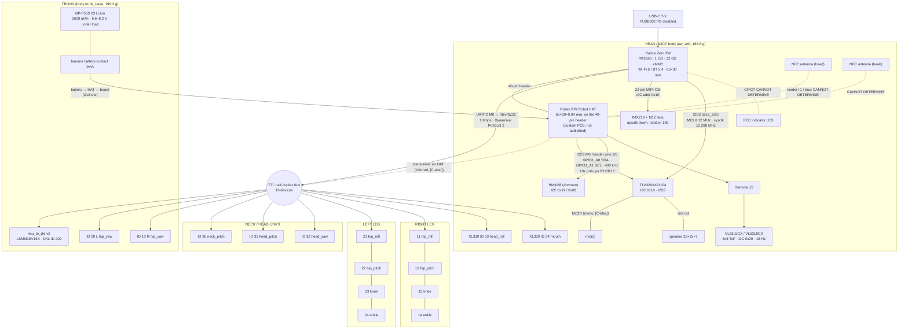

# ELECTRONICS AND SOFTWARE — what the Microduck's boards are and how the code reaches every part

*Written 2026-09-01. Companion to `PARTS.md` (what each part is) and `BOM.md`
(what to buy). Pollen's firmware and software are Apache-2.0 and were read
line by line; their PCBs are not published. So this document is exact on the
software side and inferential on the hardware side — every CANNOT DETERMINE
says what would settle it.*

## Source key

| key | file / URL |
|---|---|
| `model.rs` | `research/raw/duck-control_src_model.rs` (pollen-robotics/microduck `duck-control/src/model.rs`) |
| `bus.rs` | `research/raw/duck-control_src_bus.rs` |
| `imu.rs` | `research/raw/duck-control_src_imu.rs` |
| `proto` | `research/raw/duck-ipc-proto_lib.rs` |
| `robotd.toml` | `research/raw/deploy_robotd.toml` (section in brackets) |
| `i2c3.dts` | `research/raw/deploy_audio_i2c3-pihat.dts` |
| `aic.dts` | `research/raw/deploy_audio_aic3104-i2c3.dts` |
| `arch` | `research/raw/microduck_main_docs_design_architecture.md` |
| `rdesign` | `research/raw/microduck_main_docs_design_robotd-design.md` |
| `cheat` | `research/raw/microduck_main_docs_robot_cheatsheet.md` |
| `media` | `research/raw/microduck_main_docs_project_media-bringup.md` |
| `tof` | `research/raw/tof_src_main.rs` |
| `const.py` | `research/raw/microduck_constants.py` (microduck_rl) |
| [R1 §n] / [R2 §n] | `research/01-product-and-specs.md` / `research/02-repos-and-code.md` |
| [SPEC §n] | `SPEC.md` |
| [XL330] | https://emanual.robotis.com/docs/en/dxl/x/xl330-m288/ (via `spec/specs-published.json`) |
| [Radxa] | https://radxa.com/products/zeros/zero3w/ (R1 source S45) |
| [presskit] | https://pollen-robotics.com/microduck/press-kit/ |
| [C-elec] | `research/raw/community/replica_hardware-teardown.en.md` — **community**, unverified |

## 1. The one-picture version



Dashed lines are inferred or unknown; solid lines are read out of Pollen's
source. Servo ID → joint: `model.rs:15-19`; which servo sits in which body is
inferred from the `xl330` mesh placements (`PARTS.md` row 32). Servo power
(the bus VDD) comes from the pack through the HAT — the runtime reads the pack
voltage *as the servos' own supply* (`model.rs:99-113`), which requires the
XL330 VDD pin to be on battery, not on a regulated rail (see §3.4).

## 2. Compute — Radxa Zero 3W

| fact | value | source |
|---|---|---|
| product spec | "Rockchip RK3566 with AI accelerator", "1 GB RAM, 32 GB storage", Wi-Fi + Bluetooth | [presskit]; [R1 §2] |
| board | Radxa Zero 3W — `compatible = "radxa,zero-3w", "rockchip,rk3566"`; "/dev/ttyS2 is the Radxa Zero 3W's wiring" | `i2c3.dts:46`; `robotd.toml [bus]` |
| is it the stock module? | device tree names the stock board; whether production uses a custom carrier is **CANNOT DETERMINE** (product page only says RK3566) — a production teardown settles it | [R1 §19.7] |
| SoC | RK3566, quad Cortex-A55 "up to 1.6 GHz" (Radxa) vs "up to 1.8 GHz" (CNX — conflict), Mali-G52 2EE, 0.8 TOPS INT8 NPU (one core) | [Radxa]; [R1 §6, §19.9] |
| memory / storage | LPDDR4 1 GB; 32 GB eMMC | [presskit]; [Radxa] |
| radios | "Wi-Fi 6 / BT 5.4" on-module (press kit: radio versions provisional) | [Radxa]; [R1 §10] |
| connectors | 40-pin GPIO header; 22-pin MIPI CSI; USB 3.0 HOST Type-C; USB 2.0 OTG Type-C | [Radxa] |
| footprint | 65 × 30 mm — the MJCF still carries the prototype's `pcb__raspberry_pi_zero_2_w` mesh (65.0 × 1.6 × 30.0) in the head | [R2 §3.3]; [SPEC §4.3] |
| OS / kernel | Armbian 26.2.1 Minimal, vendor kernel `6.1.115-vendor-rk35xx` (needed for the MIPI-CSI ISP driver and the I²S tree) | [R1 §6]; `media:43-45` |
| NPU | off in Armbian's DTB; `deploy/overlays/rk3568-npu-enable.dts` + `setup-npu.sh` + reboot; `duck_detect.rknn` (yolo11n 320×320) at **2 Hz — "a thermal limit, not a preference"**: flat out 95 °C, CPU throttles to 408 MHz | `robotd.toml [detect]`; [R1 §6] |
| policy inference | ONNX Runtime, **dlopened** (`ORT_DYLIB_PATH`), installed by `scripts/install.sh`, not shipped in the release | `robotd.toml [policy]` |
| servo driver crate | `rustypot = "1.6.0"` (Pollen's own), `Xl330Controller::new().with_protocol_v2()` | `bus.rs:18,110-112`; [R2 §3.1] |
| loop rate | 50 Hz — "inherited from the prototype, where it was chosen on a Raspberry Pi Zero 2W. It has never been re-derived on the Radxa." | `robotd.toml [control]` |
| prototype | Raspberry Pi Zero 2 W + BNO055 over I²C; `apirrone/microduck_runtime` (now 404; snapshot `TommyZihao/microduck_runtime`) | [R2 §3.4] |

## 3. The servo bus — one UART, 16 devices

### 3.1 Physical

| fact | value | source |
|---|---|---|
| port | `/dev/ttyS2` = RK3566 UART2, M0 pin-mux (overlay `uart2-m0`); Armbian's `serial-getty@ttyS2` login console must be masked or `agetty` holds the bus | `robotd.toml [bus]`; `rdesign:58-61`; [R2 §3.1] |
| header pins for UART2 M0 | **CANNOT DETERMINE** from our sources — the Radxa Zero 3W GPIO pinout page settles it | — |
| rate / protocol | 1 000 000 baud, Dynamixel Protocol 2.0; EEPROM `baud_rate = 3` | `model.rs:80, 89-94` |
| electrical | XL330: "TTL Multidrop Bus (3.3V Logic, 5V Compatible)", 3-pin | [XL330]; [R1 §4.1] |
| direction control | no direction GPIO anywhere in the code → self-steering half-duplex circuit, assumed on the HAT | [C-elec] (community inference) |
| devices | 15 servos + `imu_to_dxl` (ID 200) — "There is no second bus and no second port" | `rdesign:23-38` |
| exclusive access | `serialport` sets `TIOCEXCL`; `robotd` runs as root so exclusion is "arranged rather than enforced" | `rdesign:41-56` |
| read timeout | 30 ms per transaction | `bus.rs:47` |

### 3.2 IDs and joints

| ID | joint (`JOINT_NAMES`, `proto:239-255`) | body carrying the servo (inferred, `spec/mesh-placements.json`) | range (MJCF, deg) [SPEC §3] |
|---|---|---|---|
| 20 | left_hip_yaw | trunk_base | −25 … +30 |
| 21 | left_hip_roll | yaw2roll | ±22 |
| 22 | left_hip_pitch | upper_leg_left | ±90 |
| 23 | left_knee | upper_leg_left | ±90 |
| 24 | left_ankle | leg | ±90 |
| 30 | neck_pitch | neck | −90 … +60 |
| 31 | head_pitch | neck | ±90 |
| 32 | head_yaw | yaw_roll_motion | ±170 |
| 33 | head_roll | jaw_soft (head) | ±25 |
| 34 | mouth | jaw_soft (head) | −5° closed … +30° open (`model.rs:58-63`); **not in any policy** (`MOUTH_INDEX = 9`, `model.rs:31`) |
| 10 | right_hip_yaw | trunk_base | −30 … +25 |
| 11 | right_hip_roll | bearing_roll | ±22 |
| 12 | right_hip_pitch | upper_leg_right | ±90 |
| 13 | right_knee | upper_leg_right | ±90 |
| 14 | right_ankle | leg_2 | ±90 |
| 200 | `imu_to_dxl` v2 | trunk_base (site at world (−21, 0, 105.3)) | — |

Same scheme as Open Duck Mini v2 (20–24 / 30–33 / 10–14) plus 34 [R1 §16.2].
Safety clamps targets to the *actuator's* travel (±π), not per-joint limits —
"real joint limits live in the MJCF" [R2 §3.1]; a NaN target is refused
outright (`rdesign:444-446`).

### 3.3 Registers and the tick

| what | value | source |
|---|---|---|
| EEPROM asserted **and corrected** at boot | `return_delay_time = 0` (ships at 250 = 500 µs per device; ×16 = 8 ms = 40 % of a 20 ms tick), `baud_rate = 3`, `pwm_slope = 255`, `shutdown = 52` (latches on overload, overheating, input-voltage fault) | `model.rs:82-94`; `bus.rs:122-140` |
| per-tick read | one `sync_read`, IMU first then 15 servos, address **124**, 12 bytes: present_pwm, present_current, present_velocity, present_position (…136) | `bus.rs:24-28, 100-104` |
| per-tick write | one `sync_write` of goal positions | `bus.rs:1-4` |
| slow read, every 1 s | address **144** u16 present_input_voltage (0.1 V/count) + **146** u8 present_temperature, 3 bytes, own transaction (~1 ms) — the 12-byte gap 136–144 is trajectory registers nobody wants | `bus.rs:32-44`; `rdesign:266-269` |
| conversions | velocity 0.229 rpm/count → rad/s; position 12-bit, 2048 = 0 rad | `bus.rs:31`; [R2 §3.1] |
| gains | position P **200** with I = D written to **0** (RAM registers — a power cycle restores factory D, which "damps the servo's internal PID and the robot runs" soft); standing ×0.8 (=160); limp-fall 50; limp pose ramp 160 | `robotd.toml [policy] gain, standing_gain_ratio; [safety] gain_limp, limp_fall_pose_gain`; `rdesign:259-263` |
| action scale | 0.9 walk / 0.8 roller; standing 1.0 | `robotd.toml [policy]` |
| action low-pass | head 0.5 / legs 0.7 — "must match training or transfer degrades" | `robotd.toml [policy]` |
| voltage adapt | off; when on, scale × (7.4 / EMA volts), clamp 6.0–9.5 V | `robotd.toml [policy]` |
| loop / health | 50 Hz; unhealthy below 45 Hz achieved; wedged after 25 silent periods (500 ms); 10 consecutive bus errors | `robotd.toml [control] [update_gate]` |
| stale-IMU tracker | identical 12-byte block counted; warns after 25 in a row (0.5 s) | `bus.rs:49-58` |

### 3.4 The servo vs the pack (unexplained by any source)

XL330-M288-T datasheet: input 3.7–6.0 V (5.0 V recommended), stall 0.42 /
0.52 / 0.60 N·m at 3.7 / 5 / 6 V, 18 g, 288.4:1, 4096 counts/rev, cored
motor [XL330]. The runtime reads the pack **through the servos' own
`present_input_voltage`** and maps 6.6–8.2 V to 0–100 % (`model.rs:99-113`);
the simulator fits ±0.96 N·m and randomises `vin_range = (6.5, 8.2)`
(`const.py:160`; `joints_properties.xml` [R1 §4.3]). Both say the servos see
the 2S pack directly at ~7.4 V nominal, above datasheet maximum. **Stock
part over-spec, a regulated bus, or a custom variant: CANNOT DETERMINE** — a
production unit with a meter on the servo VDD pin, or Pollen saying, settles
it [R1 §19.3]. Sub-variant M288 vs M077: never named in Pollen files
("xl330" only); community says M288-T "seen on press prototype" [R2 §5.1].

## 4. IMUs

### 4.1 Control IMU — `imu_to_dxl` v2 (ID 200)

| field | value | source |
|---|---|---|
| chip | ST **LSM6DSV16X**, SFLP block gives a game-rotation quaternion and estimates its own gyro bias on-chip | `imu.rs:1-6` |
| bus | rides the Dynamixel bus; fetched in the same `sync_read` as the servos, listed first | `imu.rs:3-4`; `bus.rs:92` |
| block at 124 | bytes 0..6 gyro x/y/z `i16` LE, ±500 dps, 17.5 mdps/LSB; bytes 6..12 SFLP quaternion x/y/z as IEEE fp16, `w = √(1 − x² − y² − z²)`; full diagnostic block 20 bytes (raw accel, sample counter, status) | `imu.rs:8-17, 47` |
| mount | quaternion `[0.7071, 0, 0.7071, 0]` = +90° about Y; `trunk = [+raw_z, +raw_y, −raw_x]` | `imu.rs:76-83` |
| readiness | 25 live quaternion blocks (~0.25 s at 100 Hz) before fall detection may trust it | `imu.rs:96-100` |
| all-zero quaternion | SFLP table not written yet — keep last good, never snap to identity | `imu.rs:113-116` |
| location | MJCF `imu` site on `trunk_base` at body (−21, 0.1, −14.7) → world (−21, 0, 105.3) | [R2 §3.2]; [SPEC §3] |
| MCU, transceiver, schematic, firmware | **CANNOT DETERMINE** — not in the repository; community says any Protocol-2-slave MCU (STM32G0/CH32V) would do | [R2 §5.4]; [C-elec] |

Fall handling built on it: fall *report* when projected gravity z > −0.5 for
200 ms; predictive `limp_fall` when already tilted past z −0.90 (~26°), still
tipping, and the 300 ms extrapolation passes −0.5, debounced 60 ms → gain 50;
still-detect 1.0 rad/s for 200 ms, max 1500 ms; ramp to stand over 600 ms at
gain 160 (`robotd.toml [safety]`).

### 4.2 Second IMU — head

Press kit: "2 IMUs, one in the body and one in the head". The HAT (which sits
in the head) carries a **BMI088 at 0x19/0x68, "dormant", "unused but still
connected"** (`i2c3.dts:11, 31`). MJCF has a `head_imu` site in the head at
world (59.2, 0, 250.8) [SPEC §3]. Whether the production head IMU is that
BMI088 or something else, and whether any shipped code reads it: **CANNOT
DETERMINE** — `i2cdetect -y 3` on a production board plus a grep of the
release binaries settles it [R1 §7.3].

## 5. Camera

| fact | value | source |
|---|---|---|
| sensor | Sony IMX219 (Pi Camera v2 class) — probe "imx219 2-0010: Model ID 0x0219, Lot ID 0x5a8e73, Chip ID 0x0773" (I²C bus 2, addr 0x10) | `media:312` |
| overlay | `radxa-zero3-rpi-camera-v2`; without it "no `/dev/video*` and nothing in dmesg" | `media:51-65` |
| lens | **M12** wide-angle — `m12_lens_holder` (23.1 × 14.8 × 16.0) + `lens` (Ø16.9 × 18.9) meshes; FOV "still being finalised" (press kit); community ~62° HFOV unverified | [SPEC §4.3]; [R1 §7.1] |
| mounting | **upside down** — `rotation = 180` done in the hardware encoder, never `videoflip` (a full CPU pass, cost 22 fps) | `media:335-357, 472` |
| position | `head_camera` site world (81.4, 0, 251.1), camera quat `0 0 -1 0`; 73 mm ahead and 15.5 mm above the head-roll axis | [SPEC §3]; [R2 §2] |
| capture | `/dev/video0` `rkisp_mainpath`, native 3280 × 2464; sensor pinned to 1920×1080@30, ISP scales; default stream 720p30 H.264 constrained-baseline at 2 Mb/s via Rockchip MPP (`mpph264enc`) | `media:313, 449`; `robotd.toml [media]` |
| indicator | "dedicated camera-use indicator inspired by classic REC lights" — GPIO/driver **CANNOT DETERMINE** (0 hits in source grep) | [presskit] |
| ribbon / module part | CANNOT DETERMINE — teardown | — |

## 6. ToF (the "compact LiDAR")

| fact | value | source |
|---|---|---|
| chip | VL53L5CX **or** VL53L8CX — both ST drivers vendored; "Both sensor generations are supported" | `tof:83-85`; `cheat:495-496`; [R2 §3.3] |
| bus / addr | `/dev/i2c-pihat` (udev symlink) then `/dev/i2c-3`; 7-bit 0x29 (factory) then 0x52 (where the prototype moved it when a BNO055 wanted 0x29) | `tof:80-87` |
| connector | HAT "Stemma J5" | `i2c3.dts:10` |
| rate / res | 8×8 at 15 Hz ("about 5 % of a 400 kHz bus"); FOV 45° × 45° | `tof:105-107`; [R2 §3.3] |
| position | `tof` site world (81.4, 22.4, 249.1) — 22.4 mm left of the camera | [SPEC §3] |
| daemon | `tofd` publishes `tof.stream` on `/run/tofd/tof.sock`; `robotd` (theremin) and `mediad` read it | `arch:88`; `proto:204, 504` |
| uses | theremin 0.10–0.70 m band, statuses [4,5,6,9,10,12,13], 250 ms hold | `robotd.toml [theremin]` |
| which generation ships, range | CANNOT DETERMINE (press kit: "LiDAR range … still being finalised") | [R1 §19.8] |

## 7. Audio

| fact | value | source |
|---|---|---|
| codec | TI **TLV320AIC3104** on the HAT, I²C 0x18 (`compatible = "ti,tlv320aic3x"`), I²S3 (`i2s3_2ch`), fixed **12 MHz MCLK**, cpu-dai sysclk **12.288 MHz** (256 × 48 kHz), card name `aic3104`, ALSA `plughw:aic3104` | `aic.dts:21-93`; `robotd.toml [audio]` |
| MCLK source | a `fixed-clock` node — whether a crystal on the HAT or an SoC clock pin: CANNOT DETERMINE | `aic.dts:25-30` |
| mic | on the head (pet_detect README); codec input Mic3R mono [C-elec]; captures from `"<device>,0"` | [R2 §1b]; `robotd.toml [audio]` |
| speaker | placeholder mesh 35 × 25 × 7 in the head; line out [C-elec]; amplifier CANNOT DETERMINE | [SPEC §4.3] |
| features | greet quack, pet-detect CNN (~20 KB, 40-band log-mel, thresholds 0.95/0.85), per-robot seeded voice bank `/var/lib/robot/sounds`, ToF theremin, chorale over Bluetooth (off by default) | `robotd.toml [audio] [theremin] [chorale]` |

## 8. NFC

"2 antennas, one in the head and one in the beak" [presskit]. Tags and an
NFC E-Ink "Polaroid" are sold (tap "on your robot's head") [R1 §7.5]. **No
NFC code exists in the published runtime** (grep of `duck-ipc-proto_lib.rs`
and `research/microduck-elec-grep.txt`: 0 hits for nfc/pn532/st25). Reader
IC, bus, antenna geometry, and whether the beak antenna is inside the soft
jaw: **CANNOT DETERMINE** — a later release of `pollen-robotics/microduck` or
a teardown settles it.

## 9. Power

| fact | value | source |
|---|---|---|
| pack | removable **NP-F550**, 2S Li-ion, 2600 mAh, ~1 h (mesh named `np_f970` but F550-sized: 38.6 × 20.6 × 70.8) | [presskit]; [SPEC §4.1, §5] |
| voltage window | full 8.2 V, empty 6.6 V, *under load through the bus*; nominal 7.4 V; linear % | `model.rs:99-128`; `robotd.toml [policy] nominal_voltage` |
| gauge | **none** — "There is no fuel gauge and no ADC. The only measurement available is what the servos report as their own supply" | `model.rs:99-105` |
| empty behaviour | EMA (~10 s) at 6.6 V → sit down gracefully and power the board off (`battery_empty_shutdown = true`); Select held 2 s does the same by hand | `robotd.toml [safety]`; `cheat:249` |
| path | "In-robot power comes from the battery via the HAT regardless" — battery → banana contact PCB → HAT → Radxa; regulators on the HAT: CANNOT DETERMINE | `i2c3.dts:22`; `PARTS.md` row 2 |
| USB-C | 5 V only — the overlay re-muxes I²C3 to M0 and **disables the FUSB302 PD controller** (`/i2c@fe5c0000/fusb302@22`); its power-on defaults present Rd on both CC lines so any charger still gives 5 V; maskrom flashing unaffected | `i2c3.dts:15-30, 50-58` |
| which USB-C port charges; tethered running; in-situ charging | CANNOT DETERMINE — test on a unit | [R1 §19] |
| charger | "Dual Battery Charger" in the Charger/Dev packs; specs CANNOT DETERMINE | `store_charger.json` |
| power switch | none in any source | — |

## 10. Software stack

### 10.1 Daemons (all Rust, Apache-2.0)

| daemon | owns | socket / port | talks to | source |
|---|---|---|---|---|
| `robotd` | motor bus, sensing, policies, safety, odometry, `robot.health` — "the only thing that touches the robot" | `/run/robotd.sock` | the Dynamixel bus | `arch:54, 82`; `proto:191` |
| `configd` | wifi (NetworkManager over D-Bus), robot name, pairing PIN (default `000000`), gamepad bonding, reboot; survives a dead `robotd` | `/run/configd.sock` | BlueZ, NM | `arch:83`; `cheat:553` |
| `updaterd` | signed releases: verify, install to `/opt/robot/daemon/releases/<ver>/`, move `current`, restart, health-gate, roll back | `/run/updaterd.sock` | GitHub releases, systemctl, robotd | `arch:75, 84`; `proto:180` |
| `btd` | nothing — BLE GATT transport for a subset of the API (`duckctl`: "The robot from a laptop over Bluetooth, with no network and no ssh") | BLE GATT service | robotd, configd, updaterd | `arch:85`; `cheat:11-12` |
| `padd` | nothing — reads the gamepad via `gilrs`, sends intents; raw input tap | `/run/padd/pad.sock` (`pad.input`) | robotd | `arch:86`; `proto:199` |
| `mediad` | camera + audio pipeline, perception (duck detector), WebRTC; "the remote front door" | TCP **:8080** console, **:8443** signalling — no unix socket | robotd, configd, updaterd | `arch:87` |
| `tofd` | the 8×8 depth matrix | `/run/tofd/tof.sock` (`tof.stream`, `tof.frame`) | the HAT's I²C bus | `arch:88`; `proto:204, 504, 521` |
| `robotctl` | the CLI — `monitor`, `health`, `configure`, `update`, `theremin`, `chorale` | every socket | — | `arch:89`; `cheat` |

Wire: **JSON-RPC 2.0, one object per line (NDJSON) over unix sockets**, mode
0660 group-gated; read-only calls ungated (`arch:185-237`). Config:
`/etc/robot/robotd.toml` (never overwritten by updates), `/var/lib/robot/config/config.json`
(name + PIN, `flock` + `rename`), `/run/<service>/identity.json` (`arch:95-100`).
Prototype ports this replaced: 9870 state frame, 9871 JPEG, 9872 UDP
commands, 9874/9875 maploc (`rdesign:580-581`).

### 10.2 The control tick (50 Hz)

```
read      one sync_read · IMU board + 15 servos · registers 124–136
decide    observation → policy → targets → clamp
write     sync_write goal positions
publish   atomics always; state frame only if someone subscribed
every 1 s slow_sensors() · registers 144–146 · voltage + temperature
```
(`rdesign:134-139`). Observation, every alpha policy, `obs[1,61] → actions[1,14]`:

```
[ gyro(3) | projected_gravity(3) | joint_pos(14) | joint_vel(14) | last_action(14) | command(13) ]
  command = vx, vy, vyaw (48..51) | neck_pitch, head_pitch, head_yaw, head_roll (51..55)
          | body x, y = 0 (55..57) | body z, roll, pitch (57..60) | body yaw = 0 (60)
```
(`rdesign:336-357`). Joints exclude the mouth; actions map onto 15 slots with
index 9 zero. Observations are *relative to the home pose*
`DEFAULT_POSITION` (`model.rs:39-55`; = `HOME_FRAME` in `const.py:107-131`;
= keyframe STAND2: hip_roll ∓5°, hip_pitch ∓26.24°, knee ∓0.28°, ankle
±25.95°, neck/head pitch +20°). A 51-D legacy net is refused at load.
State machine: Limp → enable → Homing (torque on, 2 s ramp) → Ready → policy
drives; torque stays on when the policy is disabled (`rdesign:621-644`).

### 10.3 Policies

Walk mode slots (`robotd.toml [policy]`): `alpha_walking.onnx` (the velstand
gait), `alpha_stand.onnx`, `alpha_sitstand.onnx`, `alpha_ground_pick.onnx`
(A, 4.0 s cycle, hand-back at 70 %), `ball_kick_left/right.onnx` (LB/RB,
0.5 s), `roulade.onnx` (X, 1.0 s per roll). Roller mode: `roller.onnx` +
`roller_crouch.onnx` (3.0 s, scale 0.8). Nine ONNX files on
`huggingface.co/pollen-robotics/microduck-policies` [R1 §11]. Trained in
mjlab (MuJoCo Warp) + PPO, BAM M6 actuator model (`kp_fw = 200`,
`vin_range (6.5, 8.2)`, delay 3–6 ticks, `const.py:154-166`), backlash twins
±1°, `soft_joint_pos_limit_factor = 0.9`, foot friction 1.0 condim 3
(`const.py:133-138`).

### 10.4 Gamepad map (`padd`)

| control | does |
|---|---|
| left stick | drive: forward/back + strafe · head mode: yaw + pitch · body-pose mode: up/crouch |
| right stick | drive: turn · head: neck pitch + head roll · body pose: pitch + roll |
| Start | toggle the policy |
| Y / triangle | head mode |
| B / circle | body-pose mode |
| A / cross | ground pick (roller mode: crouch) |
| X / square | roulade; hold to chain |
| LB / RB | left / right kick |
| DPad-Down | sit ↔ stand |
| RT / LT | mouth (either trigger); RT quacks, LT "wheee" |
| DPad-Up held 3 s | walk ⇄ roller (one quack / two quacks) |
| Select held 2 s | sit down, then power off |

(`cheat:236-249`.) No stop button: release the sticks and it stands;
`deadman_ms = 500` zeroes velocity if `padd` dies (`robotd.toml [safety]`).
Command EMA `cmd_alpha = head_alpha = 0.2` (`robotd.toml [control]`).

### 10.5 Media

`media.quality` 1080p30 / **720p30** (default, 2 Mb/s) / 720p15 / 360p30;
congestion control `gcc` (7.6 % of a core) / homegrown / disabled;
`webrtcsink` from `gst-plugins-rs` ≥ 0.14.5 and Rockchip MPP encoders from
`pollen-robotics/microduck-gst-plugins` (`robotd.toml [media]`; `media:153-198, 264`).
Duck detector `duck_detect.rknn` at 2 Hz, threshold 0.35, off by default
(`robotd.toml [detect]`).

## 11. Pin / connector table

| interface | Radxa side | HAT / peripheral side | status |
|---|---|---|---|
| Dynamixel bus | UART2 M0 → `/dev/ttyS2`, 1 Mbps, 3.3 V TTL | 3-pin TTL leads to 15 XL330 + `imu_to_dxl`; half-duplex transceiver on HAT (inferred) | port **known**; header pin numbers, transceiver part, connector type on HAT **CANNOT DETERMINE** (Radxa pinout page; HAT photo) |
| I²C3 (M0) | header **pins 3 / 5**, GPIO1_A0 SDA / GPIO1_A1 SCL, 400 kHz, `/dev/i2c-3` → `/dev/i2c-pihat` | codec 0x18, BMI088 0x19/0x68, ToF 0x29 via Stemma J5; one 10 kΩ pull-up pair R12/R13 | **known** (`i2c3.dts`) |
| I²S3 | `i2s3_2ch`, bit/frame master, sysclk 12.288 MHz | TLV320AIC3104 | controller known; header pins CANNOT DETERMINE |
| MCLK 12 MHz | `fixed-clock` node | codec MCLK | origin CANNOT DETERMINE |
| MIPI CSI | 22-pin connector; sensor at I²C 0x10 on bus 2 | IMX219 board, upside down | **known**; ribbon length CANNOT DETERMINE |
| USB-C | 5 V in; FUSB302 at `fusb302@22` disabled; Radxa has USB 3.0 host + USB 2.0 OTG Type-C | USB-C cable in box | which port charges: CANNOT DETERMINE |
| battery | — | NP-F550 → banana contact PCB → HAT → 40-pin (5 V to Radxa) and bus VDD | path known; regulators, fusing CANNOT DETERMINE |
| FUSB302 (USB PD) | `/i2c@fe5c0000/fusb302@22`, M1 pins GPIO3_B5/B6 | — | disabled by overlay (**known**) |
| NFC ×2 | ? | ? | CANNOT DETERMINE |
| REC LED | ? | ? | CANNOT DETERMINE |
| mic(s), speaker | codec Mic3R / line out [C-elec] | transducers | parts CANNOT DETERMINE |
| Wi-Fi / BT | on-module | gamepad (BT, `padd`), phone (BLE, `btd`), WebRTC (Wi-Fi) | **known** |
| NPU | `rk3568-npu-enable.dts` | — | known |

## 12. Open questions (each with what settles it)

1. **Servo supply**: are the XL330s on the raw 6.6–8.2 V pack (over datasheet 6.0 V)? — meter on servo VDD of a production unit.
2. **XL330 sub-variant** M288-T vs M077-T — label on a shipped servo or Dev Pack spare.
3. **Head IMU**: the HAT's BMI088 or another chip; is it read? — `i2cdetect` + release binary grep.
4. **Robot HAT schematic**: transceiver, regulators, connectors (J5 and the servo header), NFC — Pollen publishing, or a teardown; only the ODM community HAT (`blublear/open-duck-mini-hat`, KiCad, MIT) exists as a model [R2 §1c].
5. **`imu_to_dxl` v2**: MCU and firmware — not in the repo.
6. **ToF generation** L5CX vs L8CX and its range — production unit.
7. **Camera module + lens FOV** — press kit says provisional.
8. **NFC reader IC and antenna placement** — no code yet.
9. **Harness routing** through head_yaw (±170°) and neck — teardown photos.
10. **UART2 / I²S header pins** on the Radxa Zero 3W — the Radxa GPIO page (not fetched).
11. **Mic / speaker / amplifier / REC LED** part numbers and GPIOs.
12. **Charger and USB-C behaviour** with the pack fitted.

## 13. Datasheets on the shelf (added 2026-09-02, GOAL.md rung 4)

Each folder carries the vendor document byte for byte (`PROVENANCE.json`
sha256), figures quoted verbatim with page in `electrical.<kind>.json`, and
`docs/<slug>.md` with URL + fetch date. `tools/datasheet-quotes-check.py`
re-finds every quote in its document (PASS on all six; a deliberately
corrupted quote turns it FAIL — checked 2026-09-02).

| part | what | document (fetched 2026-09-02) | verdict | still CANNOT DETERMINE |
|---|---|---|---|---|
| `ce-parts/np-f550` | the 2S pack, 7.2 V 2600 mAh in Sony's NP-F550 shape | Duracell DR5 page (`7.2V 2600mAh`, `Watt Hours 18.7`, `70 × 38 × 20 mm`, `99 g`); Deity NP-F550 sheet (`Uses LG high-capacity 18650 cells`); **Sony's own spec page: every Sony host 403/404** | CANNOT DETERMINE | fitted maker/cell/certs; contact pinout (no vendor drawing exists — only forums); Sony's figures |
| `ce-parts/s-8252` | ABLIC 2-serial-cell protection IC (reference) | S8252_E.pdf `© ABLIC Inc., 2011-2019 Rev.4.0_00` | PASS (identity) | whether the HAT carries any protector; variant |
| `ce-parts/mcp73213` | Microchip 2S linear charger with OVP (reference) | DS20002190D (the first hit, DS51849A, is the eval-board guide — discarded) | PASS (identity) | in-situ charging at all; 5 V USB cannot drive it (needs ≥ ~8.7 V) |
| `ce-parts/microduck-speaker` | the 35×25×7 head speaker | representative "3525" 8 Ω 2 W box speaker — reseller spec table only (ABRA); nearest maker sheet (Same Sky CMS-35208N) is 35.5×20.5×8 and discontinued | CANNOT DETERMINE | exact part; amplifier vs codec output |
| `ce-parts/st25r3916` | NFC reader-IC candidate (two single-ended antenna drives) | DS12484 Rev 8, May 2023; `standard` ledger row (ISO/IEC 14443/15693/18092, EMVCo 3.0 — vendor claim) | PASS (identity) | the fitted NFC IC |
| `ce-parts/pn7150` | NFC controller candidate (NCI over I2C, one antenna path) | Rev. 4.2, 2 Feb 2024 — nxp.com gates plain curl with 404; browser headers get it | PASS (identity) | the fitted NFC IC; I2C address strap vs 0x18/0x19/0x29/0x68 on I2C3 |

`bin/triad check` on all six says CANNOT DETERMINE: every interface frame is
a named refusal (no geometry measured), and the pack and speaker grade
themselves so. That is the record, not a defect to paper over. Tool gap
(P11): `cecad/shelf.py` reads one `$CE_PARTS_ROOT`, so design-local
`electrical.*.json` here is not seen by `cecad/electrical.py`'s loaders —
the quote check is the consuming check that runs today.
